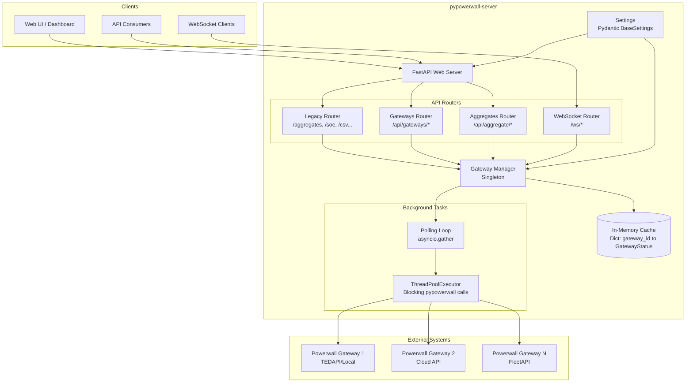
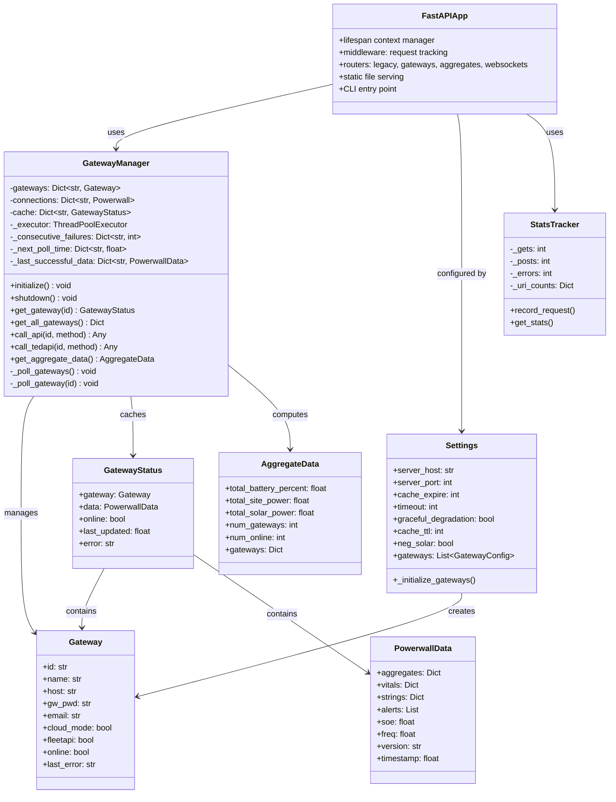
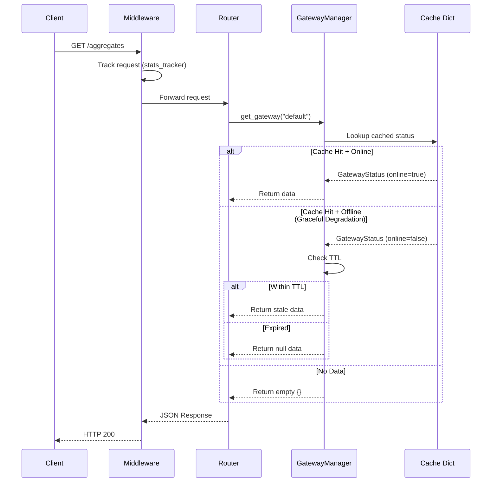
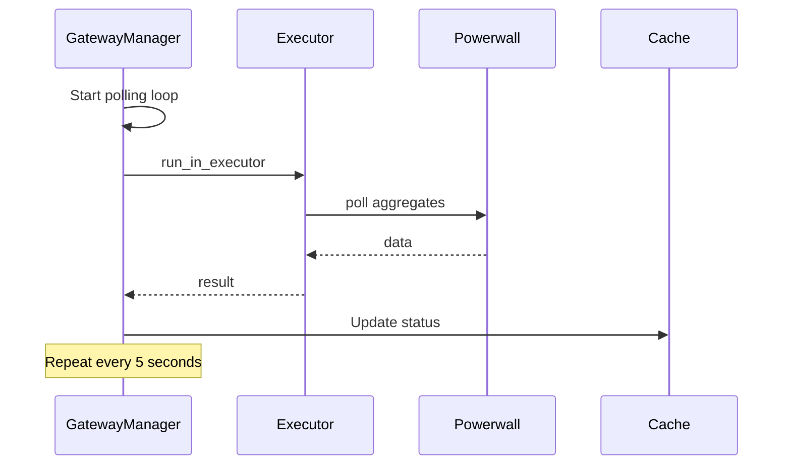
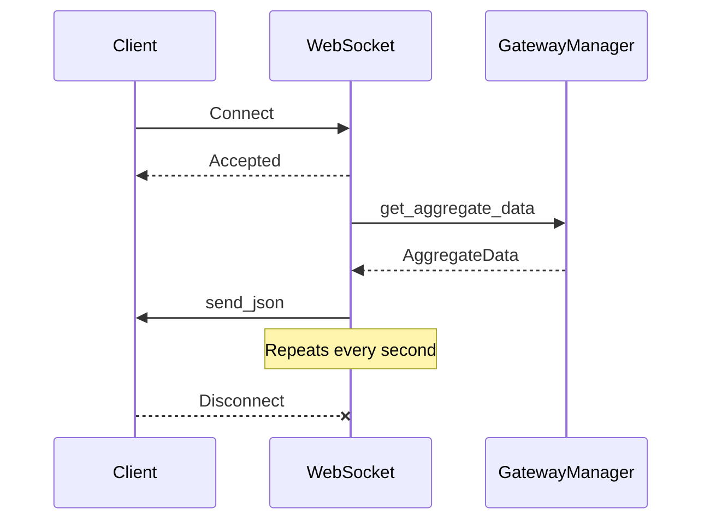
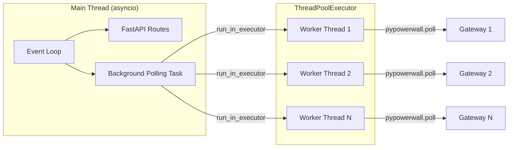
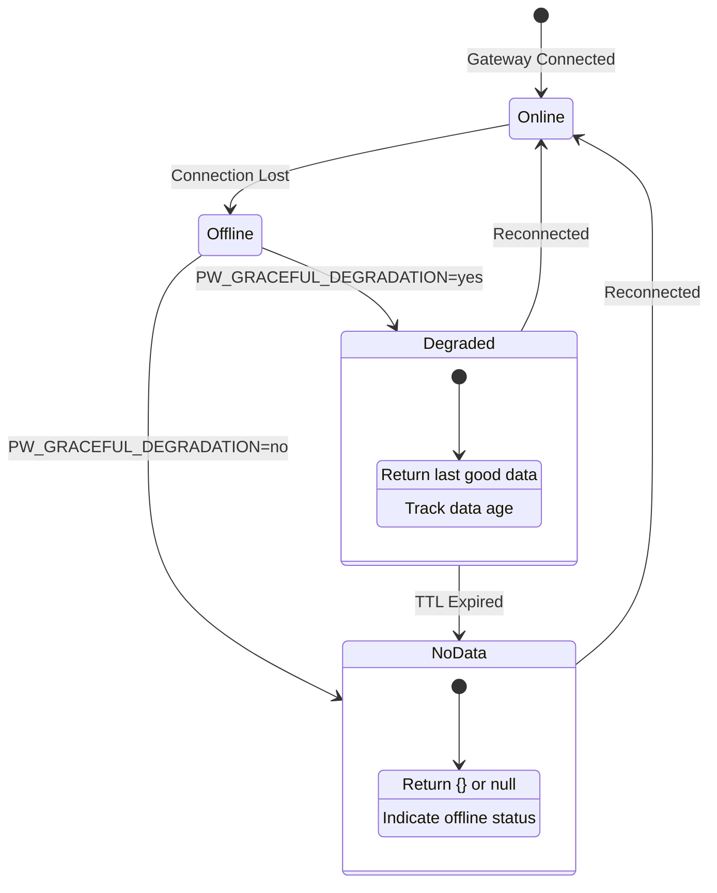
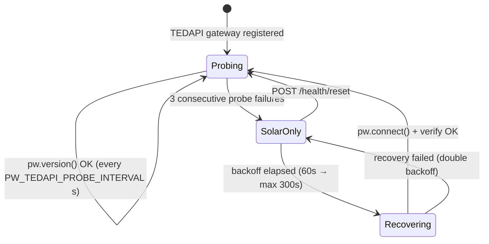
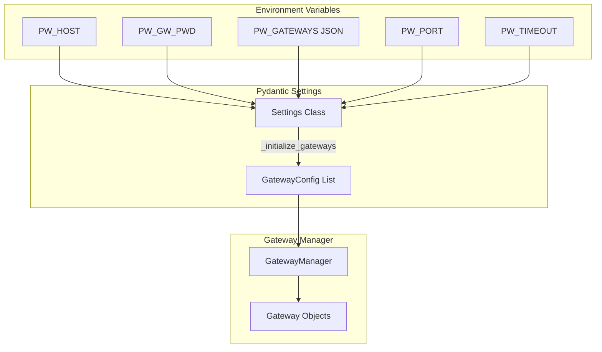

# pypowerwall-server Design Document

This document describes the architecture, design patterns, and implementation details of pypowerwall-server.

## Table of Contents

1. [Architecture Overview](#architecture-overview)
2. [Component Diagram](#component-diagram)
3. [Data Flow](#data-flow)
4. [Module Reference](#module-reference)
5. [Key Design Patterns](#key-design-patterns)
6. [Threading & Async Model](#threading--async-model)
7. [Graceful Degradation](#graceful-degradation)
8. [Configuration System](#configuration-system)
9. [Improvements & Recommendations](#improvements--recommendations)

---

## Architecture Overview

pypowerwall-server is a FastAPI-based HTTP proxy server that provides a unified REST and WebSocket API for Tesla Powerwall systems. It wraps the `pypowerwall` library to handle:

- **Multi-gateway support**: Monitor multiple Powerwall installations simultaneously
- **Background polling**: Non-blocking data collection at configurable intervals  
- **Graceful degradation**: Serve cached data during network outages
- **Legacy compatibility**: Drop-in replacement for the original pypowerwall proxy



---

## Component Diagram



---

## Data Flow

### Request Flow (REST API)



### Background Polling Flow



### WebSocket Streaming Flow



---

## Module Reference

### Core Modules

| Module | Purpose | Key Exports |
|--------|---------|-------------|
| `app/main.py` | FastAPI app, lifespan, CLI | `app`, `cli()` |
| `app/config.py` | Configuration via env vars | `settings`, `Settings`, `GatewayConfig` |
| `app/core/gateway_manager.py` | Connection pooling, polling, TEDAPI probe/recovery | `gateway_manager` (singleton) |

### API Routers

| Router | Prefix | Purpose |
|--------|--------|---------|
| `app/api/legacy.py` | None (root) | Backward-compatible proxy endpoints |
| `app/api/gateways.py` | `/api/gateways` | Multi-gateway management |
| `app/api/aggregates.py` | `/api/aggregate` | Combined data from all gateways |
| `app/api/websockets.py` | `/ws` | Real-time streaming |

### Models

| Model | Purpose |
|-------|---------|
| `Gateway` | Connection configuration (host, credentials, mode) |
| `PowerwallData` | Telemetry snapshot (aggregates, vitals, soe, etc.) |
| `GatewayStatus` | Gateway config + data + online status |
| `AggregateData` | Combined metrics from all gateways |

### Utilities

| Module | Purpose |
|--------|---------|
| `app/utils/transform.py` | Static file serving, JS injection |
| `app/utils/stats_tracker.py` | Request statistics for /stats endpoint |

---

## Key Design Patterns

### 1. Singleton Gateway Manager

The `GatewayManager` is a global singleton that centralizes all pypowerwall interactions:

```python
# gateway_manager.py
gateway_manager = GatewayManager()  # Module-level singleton

# Usage everywhere
from app.core.gateway_manager import gateway_manager
status = gateway_manager.get_gateway("default")
```

**Rationale**: Ensures single connection pool, unified cache, and coordinated polling.

### 2. Cache-First Architecture

All API endpoints read from an in-memory cache populated by background polling:

```python
@router.get("/aggregates")
async def get_aggregates():
    status = gateway_manager.get_gateway(gateway_id)
    return status.data.aggregates or {}  # Always returns from cache
```

**Benefits**:
- Instant response times (no blocking I/O during requests)
- Graceful degradation when gateways are offline
- Protects pypowerwall from request storms

**Exceptions**: control writes and the Tesla tariff routes call the Tesla cloud
on demand (executor + timeout). The unauthenticated tariff GET has its own
5-minute server-side cache with a single-flight lock, and serves the last good
tariff when a refresh fails, so clients can't turn requests into Tesla API calls.

### 3. Exponential Backoff

Failed connections use progressive retry delays to prevent hammering:

```python
backoff_intervals = [5, 10, 30, 60, 120]  # seconds
failure_count = self._consecutive_failures[gateway_id]
backoff_seconds = backoff_intervals[min(failure_count - 1, 4)]
```

### 4. ThreadPoolExecutor Bridge

pypowerwall uses blocking I/O, but FastAPI is async. The executor bridges this:

```python
result = await asyncio.wait_for(
    loop.run_in_executor(self._executor, lambda: pw.poll(path)),
    timeout=5.0
)
```

### 5. Pydantic Settings

Configuration uses Pydantic BaseSettings for validation and env var binding:

```python
class Settings(BaseSettings):
    server_port: int = Field(default=8675, validation_alias=AliasChoices('PW_PORT', 'PORT'))
```

### 6. History and Time-Series Data

The time-series store and the history UI are expected to grow over time: new
signals, new charts, new device types. To keep that growth cheap and the server
simple, history features follow these rules:

1. **Record a curated set in code; choose views in the UI.**
   - **What is recorded** is defined in code: a registry that maps a pypowerwall
     signal to a metric id, plus a catalog with each metric's label, unit and
     chart group. It is extended through reviewed PRs.
   - **Environment variables cover only what the operator pays for:** sample
     interval, retention, and turning recording off. They drive disk use and
     SD-card wear on small hosts. No per-signal environment toggles.
   - **What a user sees is a viewing choice made in the page:** series and chart
     toggles kept in the URL and remembered in browser storage. No server-side
     view configuration.
2. **The UI is driven by the metric catalog.** Adding a metric, including one in a
   new chart group, must appear in the UI without editing the page. That means one
   chart card per catalog group, with colors assigned from a palette rather than
   hard-coded per metric.
3. **History pages are a zero-setup quick look, not a dashboard builder.** Custom
   dashboards, alerting and long-term analytics belong in Powerwall-Dashboard
   (Grafana/InfluxDB) and Home Assistant, which consume the server's APIs and
   MQTT topics.
4. **Recording never adds gateway calls or blocks polling.** Samples come from data
   each poll already fetches. Database writes and queries run off the event
   loop, and a recording failure never fails a poll. Queries use their own
   read-only SQLite connection and worker thread (WAL mode), so a long history
   query never makes the next poll's writes wait.
5. **Setting and API names are permanent once released.** Environment variables,
   endpoint paths and response fields follow the no-breaking-changes rule, so
   they are chosen deliberately before merge. New data is added to responses;
   existing fields are never renamed or removed.
6. **Shared UI code lives in one place.** Charts and helpers used by more than one
   page (for example the Energy Trend chart) belong in a shared static script
   that each page loads, not in copies per page.

---

## Threading & Async Model



**Thread Pool Sizing**:
```python
max_workers = max(4, len(self._pending_configs) * 2)
```

**Why This Model**:
- pypowerwall is synchronous (uses `requests` library)
- FastAPI/uvicorn is async (must not block event loop)
- `run_in_executor` allows async code to call blocking functions

---

## Graceful Degradation

When a gateway goes offline, the system continues serving data:



**Implementation**:
```python
def get_gateway(self, gateway_id: str):
    status = self.cache.get(gateway_id)
    if status.online:
        return status
    
    if settings.graceful_degradation:
        last_success = self._last_successful_data.get(gateway_id)
        if last_success and (now - last_success.timestamp) <= settings.cache_ttl:
            return GatewayStatus(data=last_success, online=False)
    
    return status  # No data
```

### TEDAPI SolarOnly Fallback & Auto-Recovery

Distinct from transient-failure degradation above: pypowerwall's TEDAPI layer
can silently fall back to SolarOnly mode (solar data continues, battery/grid
data drops).  A per-gateway background probe task detects and recovers this
state (ported from upstream proxy t97; enabled via `PW_TEDAPI_RECOVERY`,
default `yes`).



**Key implementation points** (`gateway_manager._tedapi_probe_loop`):

- One asyncio task per TEDAPI gateway (`tedapi-probe-{id}`), started in
  `initialize()`, cancelled in `shutdown()` alongside poll tasks.
- All pypowerwall calls (`pw.version()`, `pw.connect(retry=False)`) go through
  the shared `ThreadPoolExecutor` with `asyncio.wait_for` timeouts — the probe
  never blocks the event loop.
- State is exposed via `get_fallback_state(id)` / `get_all_fallback_states()`
  (snapshot copies, never live references) and surfaced in `/health` and
  `/stats` under `fallback_mode`.  `POST /health/reset` (control-token
  authenticated) clears state; the loop re-checks state after each backoff
  sleep so a reset takes effect without waiting out the backoff.
- Hybrid-mode caveat: in v1r + WiFi topologies `pw.version()` may be served by
  the local API, so WiFi TEDAPI outage detection is best-effort there; pure
  TEDAPI mode gets full coverage.

---

## Configuration System



**Gateway Configuration Methods**:

1. **Legacy Single Gateway** (backward compatible):
   ```bash
   PW_HOST=192.168.91.1
   PW_GW_PWD=password
   ```

2. **Multi-Gateway JSON**:
   ```bash
   PW_GATEWAYS='[{"id":"home","host":"192.168.91.1","gw_pwd":"pw1"},{"id":"cabin","host":"10.0.0.5","gw_pwd":"pw2"}]'
   ```

---

## Improvements & Recommendations

### Critical Issues

#### 1. ✅ No Rate Limiting on Control Endpoints — Addressed

**Location**: [app/api/legacy.py](app/api/legacy.py#L73-L87), [app/main.py](app/main.py) (`_RateLimitMiddleware`)

**Issue**: The `/control/{path}` endpoint accepts any POST with valid auth token but has no rate limiting. A compromised token could flood the Powerwall with commands.

**Resolution**: A first-party, pure-ASGI, fixed-window rate limiter is available, applied globally (not just `/control/*`) rather than the originally-suggested `slowapi` route decorator. It is **disabled by default** (`PW_RATE_LIMIT_ENABLED`) so it never regresses the common Powerwall-Dashboard/Grafana/Home Assistant polling use case; when enabled, limits and bucket-count are configurable via `PW_RATE_LIMIT_MAX_REQUESTS`, `PW_RATE_LIMIT_WINDOW_SECONDS`, and `PW_RATE_LIMIT_MAX_BUCKETS` (the last bounding memory via pruning). See the README "Rate Limiting" section for configuration and caveats (reverse-proxy shared-IP buckets, and the recommendation to pair this with a real reverse-proxy rate limiter for internet-exposed deployments).

#### 2. ⚠️ Import Statement Inside Function

**Location**: [app/core/gateway_manager.py](app/core/gateway_manager.py#L400-L420)

**Issue**: `import json` appears inside the polling loop, executed on every poll cycle:

```python
elif networks_result and isinstance(networks_result, str):
    import json  # <-- Repeated import
    try:
        data.networks = json.loads(networks_result)
```

**Recommendation**: Move to top of file with other imports.

#### 3. ⚠️ Thread Safety Concern in StatsTracker

**Location**: [app/utils/stats_tracker.py](app/utils/stats_tracker.py)

**Issue**: While `_lock` is used for counter updates, the `_uri_counts` defaultdict could theoretically have race conditions during dictionary growth. This is low-risk due to Python's GIL but worth noting.

**Recommendation**: Consider using `collections.Counter` or ensure lock is held during dict operations.

### Architectural Improvements

#### 1. Consider Connection Health Monitoring

**Current**: Failures are tracked but not exposed via health endpoint.

**Recommendation**: Add `/health/gateways` endpoint that returns per-gateway health metrics:
```json
{
  "gateways": {
    "home": {"status": "healthy", "latency_ms": 45, "consecutive_failures": 0},
    "cabin": {"status": "degraded", "latency_ms": null, "consecutive_failures": 3}
  }
}
```

#### 2. Structured Logging

**Current**: Uses Python's basic logging with string formatting.

**Recommendation**: Use structured logging (JSON format) for better log aggregation:
```python
import structlog
logger = structlog.get_logger()
logger.info("gateway_poll_complete", gateway_id=gw_id, latency_ms=elapsed)
```

### Suboptimal Patterns

#### 1. Repeated Default Gateway Lookup

**Location**: Every legacy endpoint calls `get_default_gateway()`:

```python
@router.get("/vitals")
async def get_vitals():
    gateway_id = get_default_gateway()  # Called every request
```

**Recommendation**: Cache the default gateway ID or use dependency injection:
```python
def get_default_gateway_dep() -> str:
    return get_default_gateway()

@router.get("/vitals")
async def get_vitals(gateway_id: str = Depends(get_default_gateway_dep)):
```

#### 2. Deep Copy on Every Aggregates Request

**Location**: [app/api/legacy.py](app/api/legacy.py#L128)

```python
aggregates = deepcopy(status.data.aggregates)
```

**Issue**: `deepcopy` is expensive; called on every `/aggregates` request.

**Recommendation**: Only copy if modifying (neg_solar correction):
```python
aggregates = status.data.aggregates
if not settings.neg_solar and aggregates.get('solar', {}).get('instant_power', 0) < 0:
    aggregates = deepcopy(aggregates)  # Copy only when needed
    # ... modify
```

#### 3. Polling Loop Runs Even With No Gateways

**Location**: [app/core/gateway_manager.py](app/core/gateway_manager.py#L192-L205)

**Issue**: The polling loop starts at server boot even if no gateways are configured.

**Recommendation**: Check for gateways before starting loop:
```python
if not self.gateways:
    logger.warning("No gateways configured, polling disabled")
    return
```

### Unused Code

#### 1. `counter` Field in Stats

**Location**: [app/api/legacy.py](app/api/legacy.py#L918)

```python
"counter": 0,  # Legacy field, not used
```

This field exists for compatibility but is never populated. Consider documenting why or removing if legacy support isn't needed.

#### 2. `din` Field Type Variance

**Location**: [app/models/gateway.py](app/models/gateway.py#L109)

```python
din: Optional[Union[str, Dict[str, Any]]] = None
```

The `din` field accepts both `str` and `Dict`, but it's unclear when a Dict would be returned. This may be defensive typing that could be simplified.

### Testing Gaps

1. **No WebSocket Tests**: The `websockets.py` router has no corresponding test file.

2. **No Integration Tests**: All tests use mocked pypowerwall; no tests against real or simulated gateways.

3. **No Load Tests**: No benchmarks for concurrent request handling or WebSocket scaling.

---

## Summary

pypowerwall-server is a well-structured FastAPI application with solid async architecture and thoughtful graceful degradation. The main areas for improvement are:

| Priority | Area | Effort |
|----------|------|--------|
| ~~High~~ Done | ~~Rate limiting on control endpoints~~ Available via `PW_RATE_LIMIT_ENABLED` (default off) | Low |
| Medium | Move imports to top of file | Trivial |
| Medium | Structured logging | Medium |
| Low | Optimize deepcopy usage | Low |
| Low | Add WebSocket tests | Medium |

The codebase demonstrates good practices:
- ✅ Comprehensive docstrings
- ✅ Type hints throughout
- ✅ Pydantic models for validation
- ✅ Singleton pattern for shared state
- ✅ Graceful degradation for resilience
- ✅ Exponential backoff for reliability
